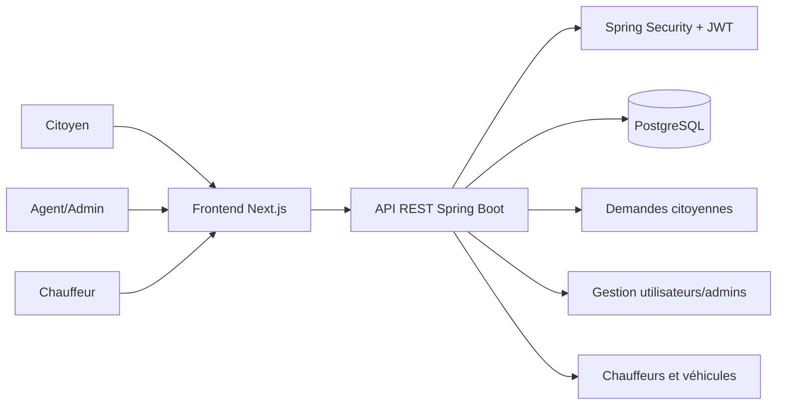

# Rapport de présentation du projet

Projet : Portail citoyen de la Commune de Nouirat  
Auteur : à compléter  
Encadrant : M. Lahmer  
Date : 07/06/2026  

---

## 1. Présentation générale

Le projet est une application web de gestion des services citoyens de la Commune de Nouirat.  
L’objectif principal est de permettre aux citoyens de déposer des demandes administratives en ligne, puis de permettre aux agents communaux de suivre, traiter, accepter, rejeter ou superviser ces demandes depuis un tableau de bord.

Les principaux services intégrés sont :

- Demande de véhicule : ambulance et véhicule funéraire.
- Raccordement : eau potable et électricité.
- Légalisation : signature et copie conforme.
- Attestation administrative liée aux biens immobiliers.
- État civil : déclaration de décès, déclaration de naissance, certificat de fiançailles, livret de famille.
- Suivi des demandes par le citoyen.
- Tableau de bord administratif.
- Gestion des utilisateurs, admins, chauffeurs et véhicules.
- Espace chauffeur pour consulter les missions assignées.

Remarque : le projet ne possède pas encore de logo officiel. Pour cette version, l’identité visuelle utilise un logo temporaire textuel `Commune de Nouirat` / `JN`.

---

## 2. Architecture du projet

Avant de présenter la structure des dossiers, il est important de préciser que l’application a été organisée selon une architecture séparée entre le frontend et le backend. Cette organisation permet de distinguer clairement la partie visible par l’utilisateur, qui gère les interfaces et les interactions, de la partie serveur, qui gère la logique métier, la sécurité, les données et les communications avec la base de données. Ce choix rend le projet plus lisible, plus facile à maintenir et plus simple à faire évoluer, car chaque partie peut être développée, testée et améliorée indépendamment.

Le projet est séparé en deux parties principales :

- `frontend` : interface utilisateur développée avec Next.js, React, TypeScript et Tailwind CSS.
- `backend` : API REST développée avec Spring Boot, Spring Security, JWT, JPA/Hibernate et PostgreSQL.

Architecture simplifiée :

```text
nwirat/
├── frontend/
│   ├── app/
│   │   ├── layout.tsx
│   │   └── page.tsx
│   ├── components/
│   │   ├── MainDashboard.tsx
│   │   ├── Sidebar.tsx
│   │   ├── Login.tsx
│   │   ├── VehicleRequest.tsx
│   │   ├── AuthorizationServices.tsx
│   │   ├── LegalisationRequest.tsx
│   │   ├── AdministrativeAttestationRequest.tsx
│   │   ├── CivilStatusRequest.tsx
│   │   ├── TrackRequests.tsx
│   │   ├── DriverMissions.tsx
│   │   └── dashboard/
│   │       ├── StaffDashboard.tsx
│   │       ├── DashboardSidebar.tsx
│   │       ├── DashboardTopBar.tsx
│   │       ├── RequestsSection.tsx
│   │       ├── UsersSection.tsx
│   │       ├── AdminsSection.tsx
│   │       └── FleetSection.tsx
│   ├── public/
│   ├── package.json
│   └── next.config.ts
│
└── backend/
    ├── src/main/java/com/ambulance/app/
    │   ├── auth/
    │   ├── user/
    │   ├── admin/
    │   ├── request/
    │   ├── authorization/
    │   ├── legalisation/
    │   ├── attestation/
    │   ├── civilstatus/
    │   ├── driver/
    │   ├── vehicle/
    │   └── config/
    ├── src/main/resources/application.properties
    └── pom.xml
```

### Schéma logique de l’application



---

## 3. Charte graphique

L’application utilise une identité visuelle moderne, administrative et professionnelle.

### Couleurs principales

| Usage | Couleur | Code |
|---|---:|---:|
| Couleur principale commune | Vert profond | `#064e3b` |
| Variante verte foncée | Vert Nouirat | `#063f35` |
| Fond général | Vert très clair / gris chaud | `#f5f7ef` |
| Texte principal | Slate sombre | `#0f172a` |
| Fond dashboard | Blanc + gris clair | `#ffffff`, `#f8fafc` |
| Alertes positives | Vert clair | `emerald-50 / emerald-700` |
| Alertes négatives | Rouge clair | `rose-50 / rose-700` |

### Couleurs par service

| Service | Style visuel |
|---|---|
| Demande véhicule | Rouge / bordeaux pour rappeler l’urgence et l’assistance |
| Légalisation | Bleu marine + doré pour un aspect administratif officiel |
| Raccordement | Teal pour l’eau, ambre pour l’électricité |
| Attestation administrative | Brun / doré pour le côté foncier et immobilier |
| État civil | Indigo pour distinguer les actes officiels |
| Dashboard | Blanc, vert, slate, cartes statistiques colorées |

### Typographie et composants

- Police : police système via Tailwind, lisible et professionnelle.
- Boutons : formes arrondies, forts contrastes, icônes `lucide-react`.
- Formulaires : grands champs arrondis, zones de documents séparées.
- Dashboard : cartes statistiques, tableaux, filtres, badges de statut.
- Navigation : header fixe, bouton `Mon espace`, sidebar latérale.

### Logo

Le projet ne contient pas encore de logo officiel.  
Une solution temporaire a été utilisée :

- Texte `Commune de Nouirat`.
- Badge `JN` dans le header.
- Photo de la commune utilisée dans la page d’accueil.

Proposition pour la soutenance : expliquer que le logo officiel sera intégré après validation par la commune.

---

## 4. Intégration des frameworks

### Frontend

Le frontend est développé avec :

- Next.js 16 : structure principale de l’application.
- React 19 : composants interactifs.
- TypeScript : typage du code.
- Tailwind CSS 4 : design responsive et styles rapides.
- Axios : communication avec le backend.
- jwt-decode : lecture du rôle utilisateur depuis le token JWT.
- lucide-react : icônes de l’interface.

Exemples d’intégration :

- `frontend/app/page.tsx` gère l’état de connexion.
- `frontend/components/MainDashboard.tsx` gère l’accueil, le routage interne des composants et la sidebar.
- Les composants de demande comme `VehicleRequest.tsx`, `LegalisationRequest.tsx`, `CivilStatusRequest.tsx` envoient les données vers l’API via Axios.
- Les composants du dossier `frontend/components/dashboard/` organisent le tableau de bord en sous-sections.

### Backend

Le backend est développé avec :

- Spring Boot 3.2.4.
- Java 21.
- Spring Web : API REST.
- Spring Data JPA : accès aux données.
- Hibernate : ORM.
- PostgreSQL : base de données.
- Spring Security : sécurisation.
- JWT : authentification par token.
- Lombok : réduction du code répétitif.

Configuration principale :

```properties
server.port=8080
spring.datasource.url=jdbc:postgresql://localhost:5432/ambulance_db
spring.datasource.username=postgres
spring.datasource.password=1234
spring.jpa.hibernate.ddl-auto=update
jwt.expiration=86400000
```

### Communication frontend / backend

Le frontend appelle le backend via Axios :

```ts
axios.post('http://localhost:8080/api/requests', formData, {
  headers: { Authorization: `Bearer ${token}` }
});
```

Le token JWT est stocké côté client dans `localStorage`, puis envoyé dans les headers pour accéder aux routes protégées.

---

## 5. Modules backend et routes API

| Module | Route principale | Rôle |
|---|---|---|
| Authentification | `/api/auth` | Connexion et inscription |
| Utilisateurs | `/api/users` | Profil utilisateur |
| Admin users | `/api/admin/users` | Ban, droits admin, rôle chauffeur |
| Véhicules citoyens | `/api/requests` | Demandes ambulance / funéraire |
| Raccordement | `/api/authorizations` | Eau et électricité |
| Légalisation | `/api/legalisation` | Signature et copie conforme |
| Attestation administrative | `/api/administrative-attestations` | Attestation liée au bien immobilier |
| État civil | `/api/civil-status` | Décès, naissance, fiançailles, livret |
| Chauffeurs | `/api/drivers` | Gestion des chauffeurs |
| Véhicules | `/api/vehicles` | Gestion des véhicules communaux |

Exemples d’actions :

- `POST /api/auth/login` : connexion.
- `POST /api/requests` : créer une demande de véhicule.
- `PATCH /api/requests/{id}/assign` : assigner chauffeur et véhicule.
- `GET /api/requests/driver/my` : missions du chauffeur connecté.
- `PATCH /api/admin/users/{id}/ban` : bannir ou réactiver un utilisateur.
- `POST /api/admin/users/admin-access` : donner des droits admin/agent.

---

## 6. Fonctionnalités principales

### Côté citoyen

- Connexion / inscription.
- Accès au portail public.
- Dépôt d’une demande de véhicule.
- Dépôt d’une demande de raccordement.
- Dépôt d’une demande de légalisation.
- Dépôt d’une demande d’attestation administrative.
- Dépôt d’une demande d’état civil.
- Suivi des demandes envoyées.

### Côté agent/admin

- Tableau de bord administratif.
- Gestion des demandes par service.
- Gestion globale de toutes les demandes.
- Acceptation / rejet des demandes.
- Suppression des demandes réservée à l’admin principal.
- Gestion des utilisateurs.
- Ban / unban des utilisateurs.
- Gestion des admins et permissions.
- Gestion des chauffeurs.
- Gestion des véhicules.
- Assignation d’un chauffeur et d’un véhicule à une mission.
- Visualisation du planning des missions.

### Côté chauffeur

- Connexion avec rôle chauffeur.
- Accès à la section missions.
- Consultation des missions assignées.
- Affichage des informations utiles : CIN du patient, localisation, frais, lieu de départ, lieu d’arrivée, date et heure.
- Possibilité d’annoncer la fin de mission.

---

## 7. Déploiement de l’application

L’application n’est pas encore déployée publiquement.  
Elle fonctionne actuellement dans un environnement de développement local.

### Lancement local du backend

Prérequis :

- Java 21.
- PostgreSQL.
- Base de données `ambulance_db`.
- Maven ou Maven Wrapper fonctionnel.

Commande :

```bash
cd backend
mvn spring-boot:run
```

Le backend démarre sur :

```text
http://localhost:8080
```

### Lancement local du frontend

Prérequis :

- Node.js.
- npm.

Commandes :

```bash
cd frontend
npm install
npm run dev
```

Le frontend démarre sur :

```text
http://localhost:3000
```

### Build frontend

La commande suivante a été testée avec succès :

```bash
cd frontend
npm run build
```

Remarque : Next.js affiche un avertissement concernant la présence de deux fichiers `package-lock.json`, mais le build compile correctement.

### Proposition de déploiement futur

Comme le projet n’est pas encore déployé, voici une proposition réaliste :

- Frontend : Vercel ou Netlify.
- Backend : Render, Railway ou VPS.
- Base de données : PostgreSQL hébergée sur Render, Railway, Supabase ou Neon.
- Variables d’environnement à déplacer en production :
  - `SPRING_DATASOURCE_URL`
  - `SPRING_DATASOURCE_USERNAME`
  - `SPRING_DATASOURCE_PASSWORD`
  - `JWT_SECRET`
  - `NEXT_PUBLIC_API_URL`

Important : le secret JWT et le mot de passe PostgreSQL ne doivent pas rester écrits directement dans `application.properties` en production.

---

## 8. Captures d’écran à fournir avec commentaires

Les captures doivent être prises dans l’environnement de développement local, par exemple sur :

```text
http://localhost:3000
```

### Capture 1 : Page de connexion

Commentaire proposé :

> Cette interface permet à l’utilisateur de se connecter au portail. Après authentification, un token JWT est stocké côté client et utilisé pour accéder aux services protégés.

### Capture 2 : Page d’accueil du portail

Commentaire proposé :

> La page d’accueil présente la Commune de Nouirat, les services principaux et les accès rapides. Elle utilise une identité visuelle moderne avec une photo de la commune, un header fixe et un bouton `Mon espace`.

### Capture 3 : Sidebar citoyenne

Commentaire proposé :

> La sidebar regroupe les démarches citoyennes : demande de véhicule, raccordement, légalisation, attestation administrative, état civil et suivi des demandes.

### Capture 4 : Demande de véhicule

Commentaire proposé :

> Cette interface permet de choisir entre ambulance et véhicule funéraire. Le formulaire affiche les informations du trajet, la date de mission, les frais éventuels et l’importation du document obligatoire.

### Capture 5 : Légalisation

Commentaire proposé :

> Le service de légalisation permet de choisir entre légalisation de signature et copie conforme. Chaque document requis possède son propre bloc d’importation afin de vérifier le dossier avant l’envoi.

### Capture 6 : Raccordement

Commentaire proposé :

> Cette interface permet de demander un raccordement à l’eau potable ou à l’électricité. Le formulaire demande les informations du citoyen et les pièces administratives nécessaires.

### Capture 7 : État civil

Commentaire proposé :

> L’utilisateur choisit d’abord le type de service d’état civil. Le formulaire reste masqué tant que le service n’est pas choisi, puis affiche les documents requis selon le cas sélectionné.

### Capture 8 : Tableau de bord admin

Commentaire proposé :

> Le tableau de bord permet aux agents et admins de superviser les demandes. Il contient des cartes statistiques, des filtres, une recherche, un tri et des actions de traitement.

### Capture 9 : Gestion des utilisateurs

Commentaire proposé :

> Cette interface affiche les utilisateurs de la base de données. L’admin peut filtrer les rôles, rechercher un utilisateur et bannir ou réactiver un compte.

### Capture 10 : Gestion admins

Commentaire proposé :

> La gestion des admins permet d’ajouter un agent par email et de lui attribuer des droits spécifiques selon les services qu’il peut gérer.

### Capture 11 : Chauffeurs et véhicules

Commentaire proposé :

> Cette interface permet de gérer les chauffeurs, les véhicules et leurs disponibilités. Elle affiche également un planning compact des missions assignées.

### Capture 12 : Espace chauffeur

Commentaire proposé :

> Le chauffeur connecté peut consulter ses missions assignées avec les informations nécessaires : patient, CIN, lieux de départ et d’arrivée, frais et date de mission.

---

## 9. Limites actuelles

- Le projet n’a pas encore de logo officiel.
- Le projet n’est pas encore déployé publiquement.
- La base de données est configurée localement.
- Les secrets comme `jwt.secret` sont encore dans le fichier de configuration local.
- Les captures d’écran doivent être prises manuellement depuis l’environnement de développement.

---

## 10. Améliorations possibles

- Ajouter un logo officiel de la commune.
- Déployer le frontend sur Vercel.
- Déployer le backend sur Render ou Railway.
- Externaliser les variables sensibles.
- Ajouter des tests automatisés.
- Ajouter un système de notifications.
- Ajouter une génération de reçus PDF pour chaque demande.
- Ajouter une vraie carte GPS pour les missions.
- Ajouter une meilleure gestion des documents côté serveur.

---

## 11. Conclusion

Cette application propose une solution complète de digitalisation des services communaux.  
Elle permet aux citoyens de déposer leurs demandes en ligne et aux agents de gérer efficacement les dossiers, les utilisateurs, les chauffeurs et les véhicules.

Même si le projet n’est pas encore déployé et ne possède pas encore de logo officiel, il dispose déjà d’une architecture claire, d’une interface moderne et de fonctionnalités solides pour une démonstration en environnement de développement.
